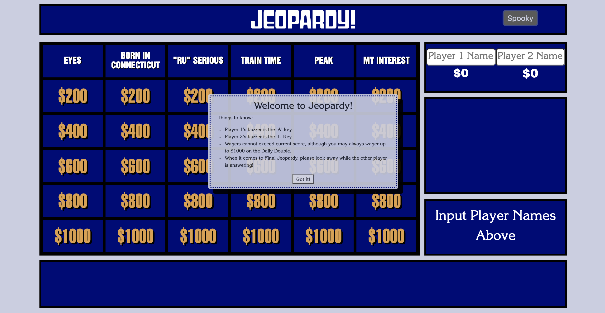
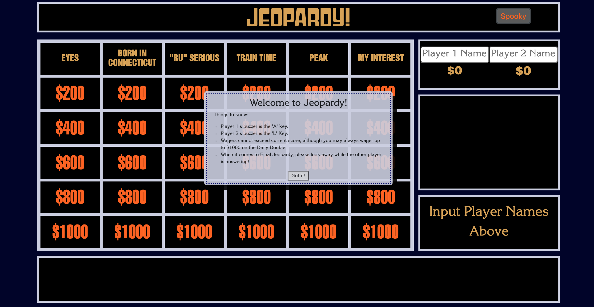
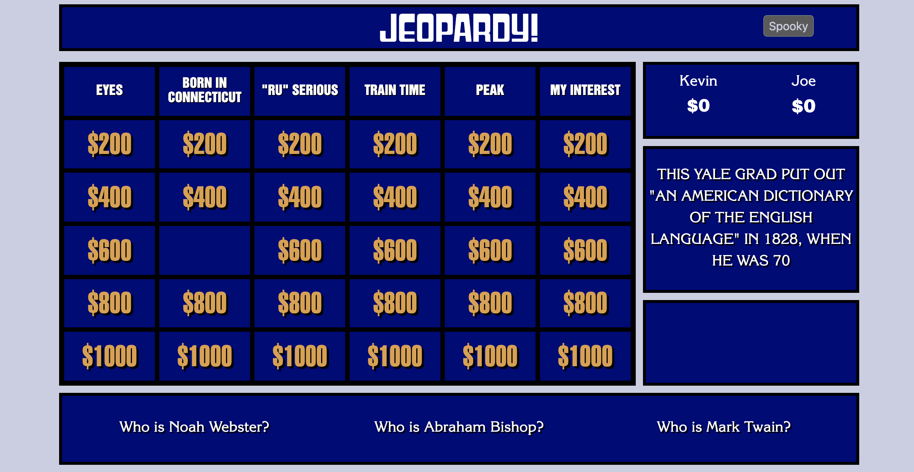
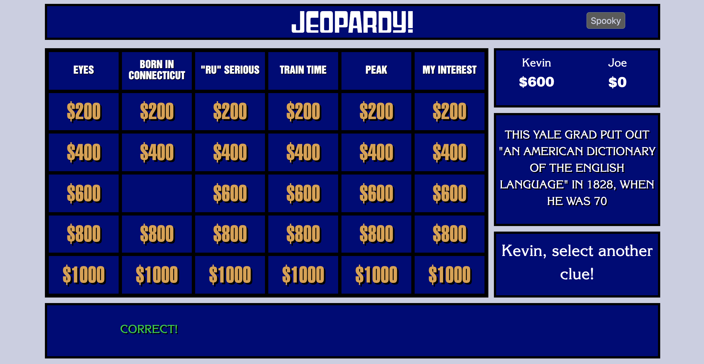
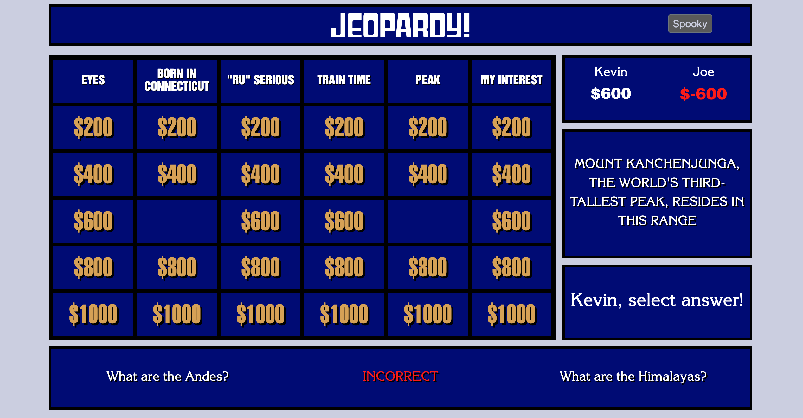
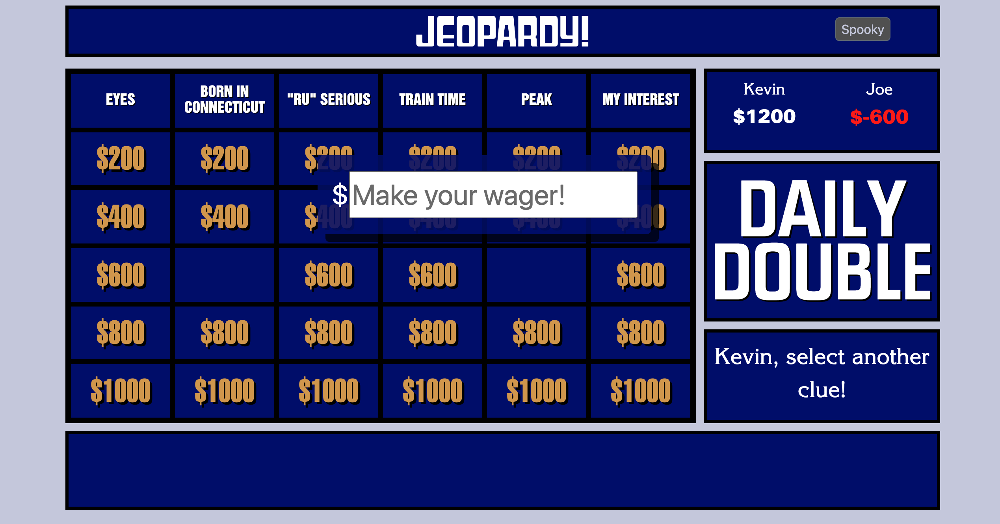
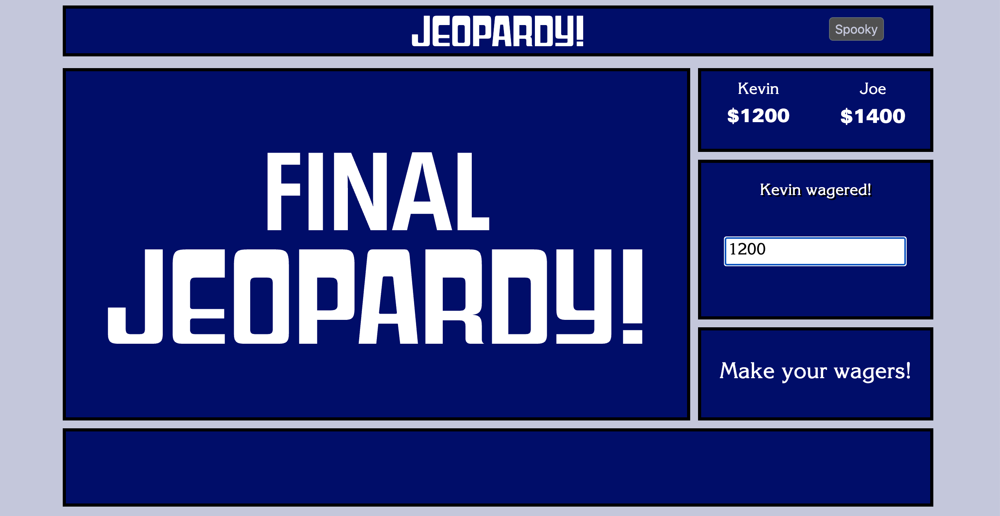
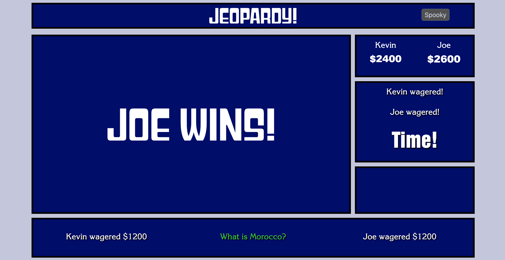

# Jeopardy!

I've made a multiple-choice, two-player version of Jeopardy!

## Background

I love trivia and Jeopardy! is probably my favorite game show. Every Tuesday, a group of my friends and I go to our favorite neighborhood bar and watch it together. That bar is sadly closing at the end of the month -- this is a small tribute.

## Getting Started

You can find a link to the live game [here](https://https://kmc-jeopardy.netlify.app/).
This is meant to be played in the web browser, with two players. A keyboard is required, so this is not mobile-compatible as of now.

## Rules

Player 1 will select the first clue

Player 1's buzzer is the "A" key, Player 2's is the "L" key

When clue is selected, it will display, along with three possible answer choices

The first player to buzz will be allowed to select an answer

If the answer is correct, they will score the dollar amount of the clue and select again

If it's incorrect, they will lose the dollar amount of the clue and the other player will be given the option to choose.

If they choose correctly, they get the amount and select the next clue

If they choose incorrectly, they also lose the dollar amount, and the original player chooses the next clue

### Daily Double

One random clue will be the Daily Double

When the Daily Double is selected, the player who selected the clue will wager an amount less than or equal to their current score (unless they have less than $1000, in which case they can wager up to $1000)

If they answer correctly, they score the amount of their wager

If they answer incorrectly, they lose the amount of their wager

In either case, they then select the next clue

### Final Jeopardy

When all the clues have been played, Final Jeopardy begins

If a player has $0 or less, the other player automatically wins

Otherwise, each player makes a wager no greater than their current score

Player 1 wagers first, then Player 2

PLEASE LOOK AWAY WHILE THE OTHER PLAYER IS WAGERING!

The category will then be displayed, and you will be prompted to start Final Jeopardy

When the timer starts, there are 30 seconds for the players to respond

Player 1 selects an answer first, then Player 2

PLEASE LOOK AWAY WHILE THE OTHER PLAYER IS GUESSING!

When the timer runs out, you will be prompted to reveal the answer

The answer will be revealed, along with the player's wagers.

If answered correctly, you add your wager to your score. If you answer incorrectly, you subtract it.

Whichever player has the highest score is the winner!

## Screenshots

Welcome Screen

Welcome Screen - Dark Mode

Clue Selection

Correct Answer!

Incorrect Answer!

Daily Double!

Final Jeopardy!

Final Jeopardy! Countdown

We Have a Winner!

## Technologies

Built with HTML, CSS, and Javascript

Animate.css, Bootstrap libraries also used

## Credits

Jeopardy design information found [here](https://fontsinuse.com/uses/5507/jeopardy-game-show)

Fonts sourced from [here](https://download-free-fonts.com)
except Steile Futura BQ [here](https://wfonts.com) and Gyparody from Adobe Fonts.

## The Future!

Features I hope to eventually implement:

  1) Create the Double Jeopardy round before final jeopardy - reinitialize board with new clues, double dollar amounts, and an additional daily double

  2) Eliminate multiple choice - process and assess typed responses

  3) Add a third player

  4) Access a large database of possible categories and clues, initializing each game with a random selection of categories

  5) Create a buzzer app that players can access on their mobile devices

  6) Create a host app, where a host player receive the typed responses and manually confirm if they are correct/incorrect

  7) After items 5 and 6 are implemented, create a mobile-friendly version of the game display that could then be used with those apps
